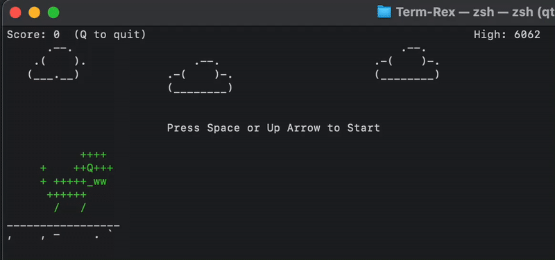

# Term-Rex: Command-Line Dino Runner

[](https://github.com/jianongHe/term-rex/releases/latest)
[](https://goreportcard.com/report/github.com/jianongHe/term-rex)
[](https://opensource.org/licenses/MIT)

A terminal-based dinosaur runner game inspired by the Chrome offline game, implemented in Golang using the termbox-go library.



```
Score: 111  (Q to quit)                                               High: 6062
          .--.                        .--.                                      
      .-(    )-.                  .-(    )-.                                    
      (________)                  (________)                          .--.      
                                                                  .-(    )-.        
                                                                  (________)         
           ++++                                                                        
    ++    ++Q++                                        /                             
     + +++++  +                                       <o=-                          
      ++++++                                           \                          
       |   |   
                    |                                                       |       
                \|/\|/                                                     \|/       
                 |  |                                                       |       
________________________________________________________________________________
   ` , -  '    `     '     `     `    -    ..   .   .    '  -  ` `    -  ` ' '  


```

## Installation

### macOS / Linux

```bash
# Install with Homebrew
brew install jianongHe/tap/term-rex
```

### Windows

```powershell
# Install with Scoop
scoop bucket add jianongHe https://github.com/jianongHe/scoop-bucket.git
scoop install term-rex
```

### Direct Download

Download the pre-built binary for your system from the [releases page](https://github.com/jianongHe/term-rex/releases/latest).

Or you can directly clone this repo and `go run main.go`

## Game Controls

| Key                             | Action |
|---------------------------------|--------|
| <kbd>Space</kbd> / <kbd>↑</kbd> | Jump |
| <kbd>↓</kbd>                    | Duck |
| <kbd>P</kbd>                    | Pause/Resume |
| <kbd>M</kbd>                    | Toggle sound |
| <kbd>R</kbd>                    | Restart (after game over) |
| <kbd>Q</kbd> / <kbd>Esc</kbd>   | Quit |

## Uninstallation

### Homebrew (macOS and Linux)

```bash
brew uninstall term-rex
brew untap jianongHe/tap  # Optional: remove the tap repository
```

### Scoop (Windows)

```powershell
scoop uninstall term-rex
scoop bucket rm jianongHe  # Optional: remove the bucket
```

## Contributing

Contributions are welcome! Feel free to submit issues or pull requests.

## License

This project is licensed under the MIT License - see the [LICENSE](LICENSE) file for details.
