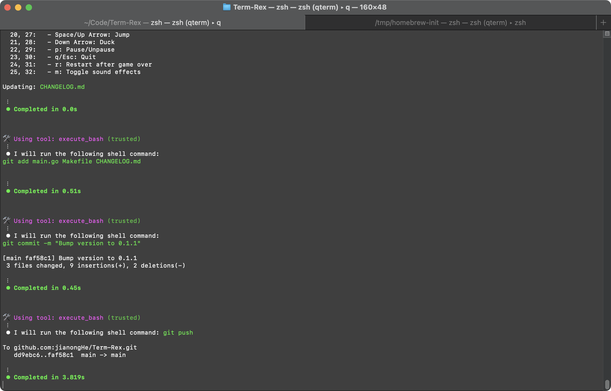
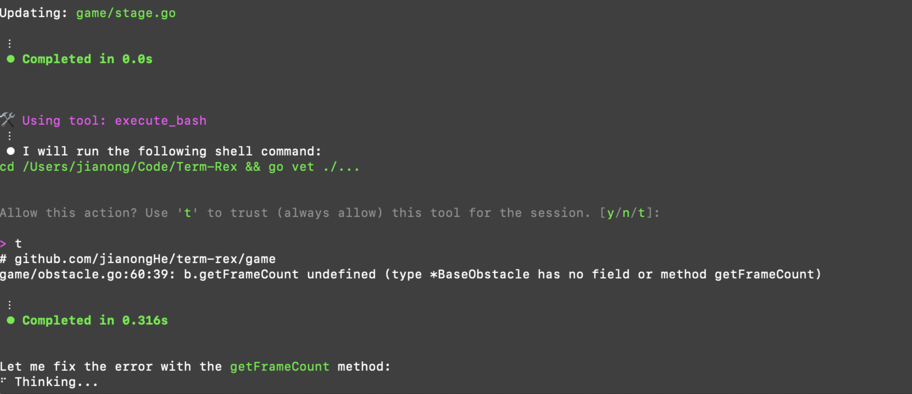
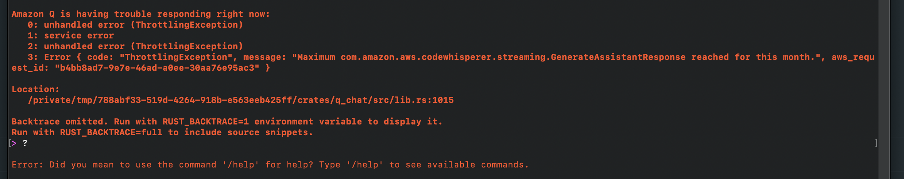

*This is a submission for the [Amazon Q Developer "Quack The Code" Challenge](https://dev.to/challenges/aws-amazon-q-v2025-04-30): That's Entertainment!*

# Term-Rex: Chrome Dino Runner Game but in terminal

## What I Built

Yes. As you can see, this is the classic Chrome offline Dino Runner game, but in command-line version. I call it `Term-Rex` or `<T/>-rex`.

What makes Term-Rex special is that **Amazon Q Developer handled approximately 90% of the development work**. 
From designing the game architecture to implementing complex game mechanics like collision detection, obstacle generation, and animation systems - Amazon Q was the driving force behind this project.

## Demo (no gif here so:)

```
Score: 131  (Q to quit)                                               High: 6062
            .--.                                                   .--.         
          .(    ).                .--.                           .(    ).       
         (___.__)             .-(    )-.                        (___.__)        
                              (________)                                        
                                                                           
                                                     /                          
                                                    <o=-                        
                                                     \                          
           ++++                
    ++    ++Q+++
     + +++++_ww           |                                                  |  
      ++++++          \|/\|/                                                /|\ 
       |   |           |  |                                                  |  
________________________________________________________________________________
` ,   ,  `   `  ,  '  '     `     `    ,    '    .   `     '  `   -  -  . '     
```


### How to Play

Term-Rex can be installed and played through multiple methods:

**Homebrew (macOS/Linux):**
```bash
brew install jianongHe/tap/term-rex
term-rex
```

**NPM:**
```bash
npm install -g term-rex
term-rex
```

**Scoop (Windows):**
```powershell
scoop bucket add jianongHe https://github.com/jianongHe/scoop-bucket.git
scoop install term-rex
```

### Direct Download

Download the pre-built binary for your system from the [releases page](https://github.com/jianongHe/term-rex/releases/latest).

Or you can directly clone [my repo](https://github.com/jianongHe/Term-Rex) and `go run main.go`

---

**Game Controls:**

| Key                             | Action |
|---------------------------------|--------|
| <kbd>Space</kbd> / <kbd>↑</kbd> | Jump |
| <kbd>↓</kbd>                    | Duck |
| <kbd>P</kbd>                    | Pause/Resume |
| <kbd>R</kbd>                    | Restart (after game over) |
| <kbd>Q</kbd> / <kbd>Esc</kbd>   | Quit |

## Code Repository

https://github.com/jianongHe/Term-Rex

## How I Used Amazon Q Developer

Did you notice the dino’s eye is a ‘Q’? Guess what? That’s Amazon Q’s, haha.
To be honest, 90% of this game’s code was done by Amazon Q. I just described everything I wanted in the terminal, and it basically did the rest.

What impressed me most about working with Amazon Q Developer was:

1. **Running in terminal**: It can directly run commands in the terminal, which makes it way more powerful. That means it can access more system operations, helping me organize project structure and run other necessary commands much more easily.

2. **Contextual Understanding**: Amazon Q understood basically the entire codebase and could make targeted improvements to specific components without breaking others.

3. **Problem-Solving**: When I encountered issues with CI/CD pipelines or version synchronization, Amazon Q quickly diagnosed and resolved them.

4. **Code Quality**: The code Amazon Q produced was clean, well-documented, and followed best practices - no spaghetti code or technical debt.

5. **Learning Opportunity**: Working with Amazon Q taught me advanced Go programming techniques and game development patterns I wouldn't have discovered on my own.

6. **and more...**


My journey with Term-Rex showcases the transformative power of Amazon Q Developer in game development. It only took me within 24 hours to finish this game Here's how Amazon Q revolutionized my workflow:

### 1. Architecture Design & Project Setup

I started with a simple prompt: "Help me create a terminal-based dinosaur runner game in Go." Amazon Q immediately:
- Designed a comprehensive game architecture with proper separation of concerns
- Set up the project structure with all necessary files and modules
- Implemented the game loop with proper timing and frame rate control
- Created a clean, maintainable codebase following Go best practices

### 2. Game Implementation

Amazon Q Developer implemented sophisticated game core logic that would have taken me weeks to code:

- Flexible animation system that handles sprite transitions for the dinosaur and obstacles
- The collision detection algorithm (running, jumping, ducking).
- Added a cloud system with different cloud types moving at varying speeds
- Implemented ground decorations for visual depth
- Help me to design ASCII art for all game elements

### 4. Cross-Platform Distribution

Amazon Q helped me make Term-Rex available everywhere:
- Created installation scripts for Homebrew, NPM, and Scoop(Windows)
- Set up GitHub Actions workflows for automated releases
- Ensured the game runs consistently across different terminal types
- It can even automatically help me push codes to github:



## Conclusion


在我2天内开发这个项目期间短暂的接触下来，我发现我真的开始喜欢上使用Amazon Q了，
因为原本我以为它是类似ChatGPT或者Gemini之类的LLM客户端，但是我上手后才发现它可以做更多的事情，
只要prompts写的恰当，它完全可以作为一位“资深开发者”的身份来帮助你开发，
比如自动帮你创建必要文件，自动以结构清晰可读高的方式进行OOP编码，然后再编码完成后它甚至还会自动帮你执行`go vet`来验证代码合法性，
如果有不对的地方它会持续改正:



我觉得它配合强类型语言能很大提升开发项目的效率和可靠性。

当然，它也是有缺点的，而且还是很致命的缺点，我觉得目前最大的缺点就是`reached max token` 哈哈：



---

谢谢阅读，请随意试玩这个经典的小游戏，注意：不用离线也能玩
